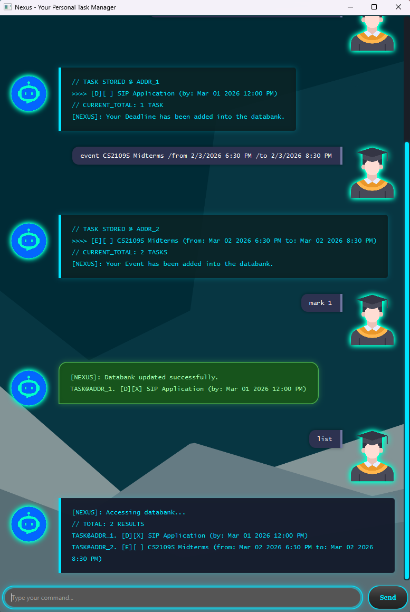

# Nexus - Your Personal Task Manager 🤖

**Nexus** is a sleek, futuristic GUI task manager that helps you manage your To-Do list, deadlines, events and more.

## UI Preview 🖼️

--------------------------------------------------------------------------

## Features ⭐
- **Manage Tasks**: Add/Delete To-Dos, Deadlines, Events and Notes
- **Track Tasks**: Mark tasks as completed or incomplete
- **Search Tasks**: Quickly find tasks using keywords
- **User-Friendly**: Provides
- **State-of-the-Art Awareness**: Warns you when your commands are invalid or when your data is corrupted
- **Persistence**: All tasks are saved after exiting the application

--------------------------------------------------------------------------

## Command Overview 🔍

| Command  | Description                                                    | Format                                              | Example                                                                     |
|----------|----------------------------------------------------------------|-----------------------------------------------------|-----------------------------------------------------------------------------|
| todo     | Add a To-Do task                                               | todo <description>                                  | todo CS2103 iP Smoke Testing                                                |
| deadline | Add a task with a deadline                                     | deadline <description> /by <date>                   | deadline CS2103 Weekly Quiz /by 2/2/2026 4:00 PM                            |
| event    | Add a task with a start date and end date                      | event <description> /from <startDate> /to <endDate> | event CS2103 Project Meeting /from 20/2/2026 12:00 PM /to 20/2/2026 2:00 PM |
| note     | Add a note                                                     | note <description>                                  | note SIP Application                                                        |
| list     | Display (all) tasks                                            | list [tasks] [deadlines] [events] [notes]           | list deadlines                                                              |
| mark     | Mark a task as completed                                       | mark <index>                                        | mark 6                                                                      |
| unmark   | Unmark a task                                                  | unmark <index>                                      | unmark 7                                                                    |
| delete   | Delete a task                                                  | delete <index>                                      | delete 2                                                                    |
| find     | Find tasks by keyword                                          | find <keyword>                                      | find CS2103                                                                 |
| check    | Look for tasks occurring on a certain date                     | check <date>                                        | check 2/2/2026                                                              |
| help     | Opens up the help window, showing a list of available commands | help                                                | help                                                                        |
| bye      | Exit the application                                           | bye                                                 | bye                                                                         |

--------------------------------------------------------------------------

## Command Summary 📋
### Adding a Task
#### To-Do:
`todo Catch up with overseas friends`

#### Deadline:
`deadline CS2103 Weekly Quiz /by 2/2/2026 4:00 PM`

#### Event:
`event CS2103 Project Meeting /from 20/2/2026 12:00 PM /to 20/2/2026 2:00 PM`

#### Note:
`note Finish EG1311 Week 6 Lecture Videos`

--------------------------------------------------------------------------

### Managing Tasks
#### List all tasks:
`list`

#### List all Deadlines:
`list deadlines`

#### List all Events:
`list events`

#### List all Notes:
`list notes`

#### Mark Task as Completed:
`mark 1`

#### Unmark Task:
`unmark 2`

#### Delete Task:
`delete 3`

#### Search for Tasks by Keyword:
`find quiz`

#### Check for Tasks on a Certain Date:
`check 2/2/2026`

--------------------------------------------------------------------------

### Quality-of-Life Features
#### Get Help:
`help`

#### Exit Application:
`bye`

> ℹ️ **IMPORTANT:** The **date** and **time** format must be in `dd/MM/yyyy HH:mm a`.
> (_e.g._ `18/2/2026 10:00 AM`, `20/10/2026 11:00 PM`)

--------------------------------------------------------------------------

## Getting Started 🚀
> ⚠️ **WARNING:** Java 17 (or above) is required to run Nexus.

1. Download the latest `nexus.jar` file from the [releases page](https://github.com/breezuu/ip/releases/tag/A-Release).

2. Copy the JAR file to the folder you wish to use as the home folder.

3. Open a terminal of your choice and navigate to the home folder by typing `cd` followed by the folder name (_e.g._ `cd testFolder`).

4. Run the application by typing `java -jar nexus.jar` in your terminal.

5. A GUI window should appear, similar to the one shown in the UI Preview section.

6. Enjoy using Nexus! 🔥

--------------------------------------------------------------------------

## Acknowledgements 🥇
- This project is based on Project Duke as part of NUS' CS2103 Software Engineering module.